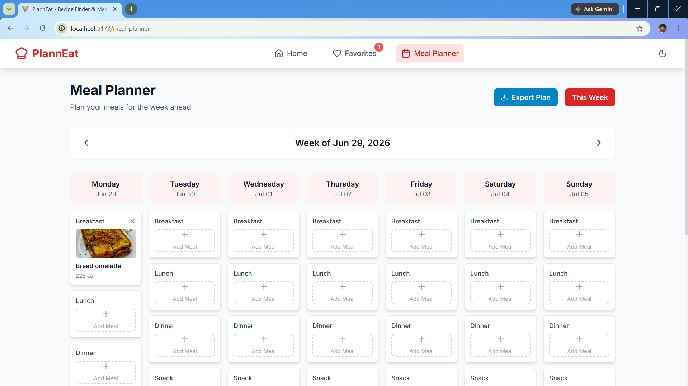
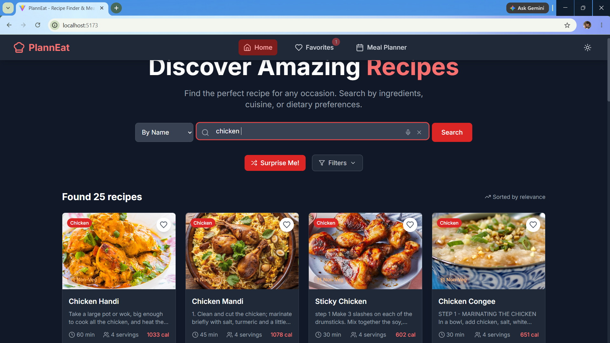

```markdown
# 🍽️ PlannEats - Recipe Finder & Meal Planner

<p align="center">
  <strong>Discover delicious recipes, save your favorites, and organize your weekly meals—all in one place.</strong>
</p>

<p align="center">
  
  
  
  
  
</p>

---

## 📖 About

PlannEats is a modern recipe discovery and meal planning web application that helps users search recipes, explore cuisines, save favorites, and organize meals for the week.

The application provides an intuitive user experience with a clean interface, responsive design, and powerful search functionality.

---

## ✨ Features

- 🔍 Search recipes by name or ingredients
- 🍽 Browse recipes from multiple cuisines
- ❤️ Save favorite recipes
- 📅 Weekly meal planner
- 📤 Export meal plans
- 🌙 Light/Dark Mode
- 📱 Fully Responsive Design
- ⚡ Fast performance using Vite
- 🎲 Surprise Me feature
- 🎯 Recipe Filters

---

# 📸 Screenshots

## 🏠 Home Page


---

## 📅 Meal Planner



---

## ❤️ Favorites


---

## 🌙 Dark Mode



## 🏠 Home Page


---

## 🔍 Recipe Search


---

## 📅 Meal Planner


---

## ❤️ Favorite Recipes


---

# 🛠 Tech Stack

| Technology | Purpose |
|------------|---------|
| React | Frontend |
| Vite | Build Tool |
| JavaScript | Programming Language |
| Tailwind CSS | Styling |
| React Router | Routing |
| Axios | API Requests |
| React Icons | Icons |
| Local Storage | Save Favorites & Meal Plans |

---

# 📂 Project Structure

```

PlannEats
│
├── public/
├── src/
│   ├── assets/
│   ├── components/
│   ├── pages/
│   ├── hooks/
│   ├── context/
│   ├── services/
│   ├── App.jsx
│   └── main.jsx
│
├── screenshots/
├── package.json
└── README.md

````

---

# ⚙️ Installation

Clone the repository

```bash
git clone https://github.com/abhay7532/PlannEats.git
````

Move into the project

```bash
cd PlannEats
```

Install dependencies

```bash
npm install
```

Run locally

```bash
npm run dev
```

Build for production

```bash
npm run build
```

---

# 🚀 Usage

1. Search recipes by keyword.
2. Browse recipe categories.
3. Save recipes to Favorites.
4. Plan meals for each day of the week.
5. Export your meal planner.

---

# 🌟 Upcoming Features

* 🔐 User Authentication
* ☁ Cloud Sync
* 🛒 Grocery List Generator
* 🤖 AI Meal Recommendations
* 📊 Nutrition Analytics
* 📱 Progressive Web App (PWA)
* 📆 Monthly Meal Planner

---

# 🤝 Contributing

Contributions are welcome!

1. Fork the repository
2. Create your feature branch

```bash
git checkout -b feature-name
```

3. Commit changes

```bash
git commit -m "Add new feature"
```

4. Push

```bash
git push origin feature-name
```

5. Open a Pull Request

---

# 👨‍💻 Author

**Abhay Verma**

* GitHub: https://github.com/abhay7532
* LinkedIn: https://www.linkedin.com/in/linkwthabhay/

---

## ⭐ Support

If you found this project useful, consider giving it a ⭐ on GitHub.

It motivates me to build more amazing projects!

---

<p align="center">
Made with ❤️ using React + Vite
</p>
```
