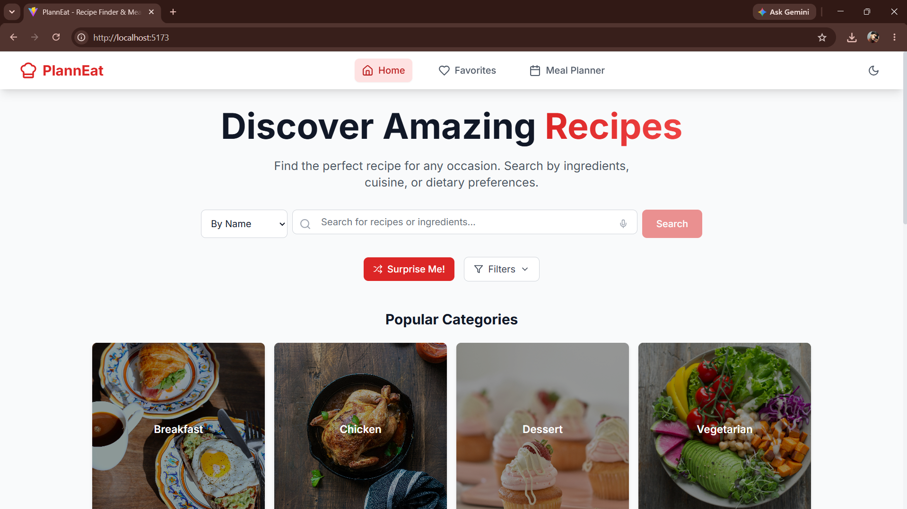
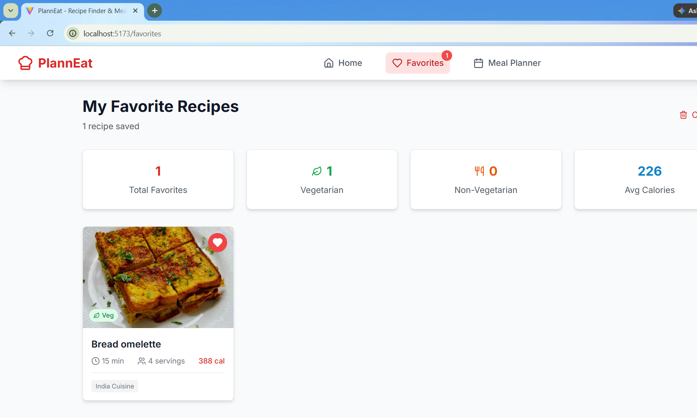

# 🍽️ PlannEats - Smart Recipe Finder & Meal Planner

<p align="center">
  <strong>Plan your meals, discover delicious recipes, and organize your weekly diet with ease.</strong>
</p>

<p align="center">
  
  
  
  
  
</p>

---

## 📖 About

**PlannEats** is a modern web application that helps users discover recipes, save their favorites, and organize weekly meal plans through a clean and responsive interface.

Whether you're planning your weekly diet or looking for your next favorite dish, PlannEats makes meal planning simple and enjoyable.

---

## ✨ Features

- 🔍 Search recipes instantly
- 🍽 Browse recipes by category
- ❤️ Save favorite recipes
- 📅 Weekly meal planner
- 🌙 Beautiful Dark Mode
- 📱 Fully Responsive Design
- ⚡ Lightning-fast performance
- 🎯 Clean and intuitive UI

---

# 🛠 Tech Stack

| Technology | Purpose |
|------------|---------|
| React | Frontend |
| Vite | Build Tool |
| JavaScript (ES6+) | Programming Language |
| Tailwind CSS | Styling |
| React Router | Navigation |
| Local Storage | Save Favorites & Meal Plans |

---

# 📸 Application Preview

<table align="center">
<tr>
<td align="center">
<b>🏠 Home Page</b><br><br>

</td>

<td align="center">
<b>📅 Meal Planner</b><br><br>

</td>
</tr>

<tr>
<td align="center">
<b>❤️ Favorites</b><br><br>

</td>

<td align="center">
<b>🌙 Dark Mode</b><br><br>

</td>
</tr>
</table>

---

# 📂 Project Structure

```text
PlannEats/
│
├── images/
├── public/
├── src/
│   ├── assets/
│   ├── components/
│   ├── context/
│   ├── hooks/
│   ├── pages/
│   ├── services/
│   ├── App.jsx
│   └── main.jsx
│
├── package.json
├── vite.config.js
└── README.md
```

---

# 🚀 Getting Started

## Clone the Repository

```bash
git clone https://github.com/abhay7532/PlannEats.git
```

## Navigate to the Project

```bash
cd PlannEats
```

## Install Dependencies

```bash
npm install
```

## Start Development Server

```bash
npm run dev
```

Open your browser and visit:

```
http://localhost:5173
```

---

# 💡 Future Enhancements

- 🔐 User Authentication
- ☁ Cloud Sync
- 🛒 Grocery List Generator
- 🤖 AI Meal Recommendations
- 📊 Nutrition Tracking
- 📱 Progressive Web App (PWA)

---

# 🤝 Contributing

Contributions are welcome!

1. Fork the repository
2. Create your feature branch

```bash
git checkout -b feature-name
```

3. Commit your changes

```bash
git commit -m "Add new feature"
```

4. Push your branch

```bash
git push origin feature-name
```

5. Open a Pull Request

---

# 👨‍💻 Developer

**Abhay Verma**

- 💼 LinkedIn: https://www.linkedin.com/in/linkwthabhay/
- 🐙 GitHub: https://github.com/abhay7532

---

## ⭐ Support

If you like this project, don't forget to **star ⭐ the repository**.

It motivates me to build more open-source projects.

---

<p align="center">
Made with ❤️ using React, Vite & Tailwind CSS
</p>
